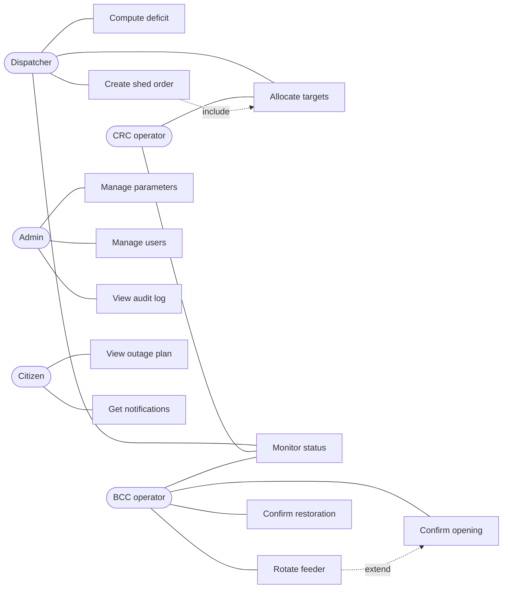
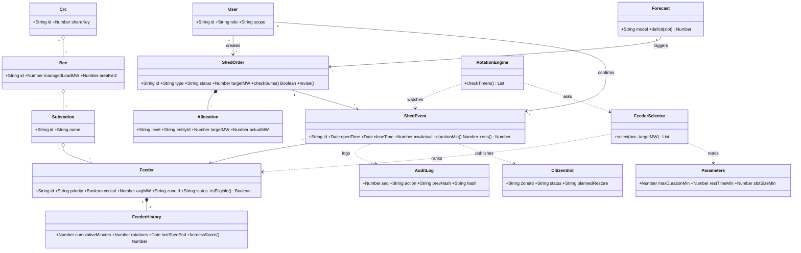

# National Intelligent Load Shedding Management Platform
## Full project documentation: from A to Z

**Challenge:** Track 2, National Intelligent Load Shedding Management Platform (manual rotating load shedding)
**Client context:** STEG (Société Tunisienne de l'Électricité et du Gaz)
**Document date:** 19 September 2026
**Status:** design phase, architecture under review (grill-me session in progress)

This document consolidates everything discussed so far: the challenge brief, the source documents, the scoping decisions, the technology choices (and how they evolved), the data model, the use cases, the class diagram, the module-by-module build plan, and the open decisions.

---

## Table of contents

1. [Challenge brief](#1-challenge-brief)
2. [Source documents and their inconsistencies](#2-source-documents-and-their-inconsistencies)
3. [Key scoping decisions](#3-key-scoping-decisions)
4. [Decision history: how the technology choice evolved](#4-decision-history-how-the-technology-choice-evolved)
5. [Final recommended stack](#5-final-recommended-stack)
6. [Target architecture](#6-target-architecture)
7. [Data: relational vs non-relational](#7-data-relational-vs-non-relational)
8. [Data model and examples](#8-data-model-and-examples)
9. [Core algorithms](#9-core-algorithms)
10. [Use case diagram](#10-use-case-diagram)
11. [The 12 use cases in detail](#11-the-12-use-cases-in-detail)
12. [Worked examples for each use case](#12-worked-examples-for-each-use-case)
13. [Class diagram](#13-class-diagram)
14. [Module-by-module build plan (final stack)](#14-module-by-module-build-plan-final-stack)
15. [Citizen communication](#15-citizen-communication)
16. [Demo scenario](#16-demo-scenario)
17. [Risks and mitigations](#17-risks-and-mitigations)
18. [Grill-me session: open decisions](#18-grill-me-session-open-decisions)
19. [Next steps](#19-next-steps)

---

## 1. Challenge brief

**Track 2: National Intelligent Load Shedding Management Platform.** Design and develop an intelligent decision-support platform for optimizing load shedding operations at a national scale. The system determines **where, when and how** electricity outages should be applied, based on demand forecasts, available resources and operational constraints.

The solution must:

- ensure **fair rotation** across regions;
- respect **priority levels** of critical infrastructures;
- **limit outage durations**;
- provide **real-time visibility** and **transparent communication to citizens**.

Objective: improve efficiency, equity and responsiveness in managing supply-demand imbalances.

---

## 2. Source documents and their inconsistencies

Three documents were provided.

| Document | Nature |
|---|---|
| **Cahier des charges** (National Real-Time Manual Rotating Load Shedding Management Platform, 22 pages) | Functional and technical specifications |
| **Note conceptuelle** (STEG-DCRTE, July 2026, v1.0) | Project concept note, prior to the detailed specification |
| **Présentation simplifiée** (13 slides) | Summary of the specification |

### Main content of the documents

- **Process:** forecast, balance offer/demand, identify deficit, set a shedding target, allocate (Dispatching → CRC North/South → 7 BCC → MT feeders), execute, measure, adjust, rotate, restore, report. Principle: every order produces measurable, time-stamped feedback (closed-loop).
- **Deficit formula:** `P_deficit = P_demand − P_generation − P_interconnections`.
- **Regional key:** about 2/3 CRC North and 1/3 CRC South, adjustable.
- **Consistency rule:** `Σ P_BCC = P_CRC`.
- **Rotation:** track current duration, cumulative duration, number of rotations, last shedding event, instantaneous power and priority per feeder.
- **Dashboard example:** required 300 MW, actual 287 MW, gap 13 MW, 27 feeders open, 7 active BCCs, maximum duration 28 min, energy not supplied (ENS) 1,245 MWh.
- **ENS:** `E = ∫ P_LS(t) dt`, national ENS = sum over feeders.
- **Roles:** Dispatching, CRC North/South, BCC, Administrator.
- **Requirements:** F01 to F10 (orders, allocation, monitoring, timers and alarms, rotation, additional shedding, performance, ENS, audit trail, dashboards) plus non-functional (24/7, redundancy, cybersecurity, RBAC, audit trail, resilience, backup).
- **Roadmap:** 9 phases from requirements to national deployment.

### Inconsistencies found

| Topic | Cahier des charges | Note conceptuelle (STEG) |
|---|---|---|
| SCADA / EMS integration | Yes (OPC, ICCP, API) | **No.** No SCADA/EMS/DMS link, no remote control, BCC operators enter execution data manually |
| Maximum outage per feeder | 30 min (example: "limit 30 min") | **45 min** recommended |
| Priority levels | Generic priority attribute | **P0** (never shed) to **P5** (first candidates) |
| Citizen platform | Not covered | **Yes** (zones, time slots, restoration estimates) |
| Planning | J-1 plus real time | J-1 in 15 or 30 min steps |
| Validation | Not explicit | Final validation left to the BCC operator |

The concept note also lists medium-term evolutions: AI models for shedding optimization, advanced load forecasts and decentralized PV, flexibilities (demand response, storage, self-consumption), and advanced decision support **in addition to, not replacing**, SCADA/EMS/DMS.

---

## 3. Key scoping decisions

### 3.1 Follow the STEG concept note (recommended, confirmation pending)

Version 1 is a **standalone decision-support and tracking platform** with **manual entry by BCC operators**. An **adapter layer** is designed so SCADA/EMS/ICCP/OPC can plug in later, presented as the roadmap. This matches the Track 2 brief and is realistic for a challenge. The 45 min limit is a **configurable parameter**.

This is Question 1 of the grill-me session and still awaits your confirmation (see section 18).

### 3.2 You do not predict the deficit

Final answer after clarification: **No, you do not build a forecasting model.**

- The Dispatching National already produces the forecast inputs (demand, generation, imports, margin). The concept note lists advanced load forecasting as a **medium-term evolution**.
- The platform only **computes** `deficit = demand − generation − imports − margin` from values the dispatcher **enters or imports (CSV)** per 15 or 30 min slot.
- You still need a deficit per slot as input to the optimizer, so the calculation stays, but the prediction is out of scope.
- Pitch line: "Load forecasting and AI optimization are on the roadmap, as in STEG's concept note. Version 1 takes the deficit from the Dispatching National and focuses on fair, priority-aware, traceable execution."

An earlier suggestion of an optional "level 2" simple forecast was downgraded to not required, because it could look like ignoring the project's boundaries.

### 3.3 The platform proposes, humans validate

The engine only proposes feeders, rotations and allocations. The BCC operator, the CRC operator and the dispatcher always validate. This matches the concept note ("validation finale laissée à l'opérateur BCC").

---

## 4. Decision history: how the technology choice evolved

| Step | What happened | Outcome |
|---|---|---|
| 1 | First recommendation | PostgreSQL + TimescaleDB, Python FastAPI, OR-Tools CP-SAT, Redis, React |
| 2 | You asked about MongoDB + Node.js + React | Rated: React 9/10, Node.js 7/10, MongoDB 6.5/10. MERN is workable, main risk is the optimizer and forecast living in Node |
| 3 | You said these are the only tools you know | Short recommendation: MERN, pure Node, greedy optimizer with fairness score |
| 4 | You asked whether the data is relational or not | Answer: mostly relational, with some non-relational parts. MongoDB stays acceptable at this scale |
| 5 | Data examples, use case diagram, class diagram | Produced, based on the MERN recommendation |
| 6 | You said "forget about MERN, I want the best adequate technologies" | **Final stack: PostgreSQL + FastAPI + React TypeScript** (section 5) |

The examples in section 8 were first written as MongoDB documents. With the final stack they map to PostgreSQL tables (mapping given in section 13).

---

## 5. Final recommended stack

**PostgreSQL, Python (FastAPI), React with TypeScript.** It fits because the data is mostly relational, the core is an optimization problem (Python has the best tools), the `Σ P_BCC = P_CRC` rule needs real transactions and constraints, and the audit trail needs database-enforced immutability.

| Layer | Choice | Why it fits |
|---|---|---|
| Database | **PostgreSQL 16** | Foreign keys and CHECK constraints protect the hierarchy. Transactions keep allocation sums exact. SQL makes fairness reports easy (window functions, Gini index) |
| Time series | Plain PostgreSQL, partitioned by month | About 200 feeders and 30 min slots means tiny volume. TimescaleDB only if SCADA data arrives later |
| Backend | **Python 3.12 + FastAPI** | Pydantic typed models, automatic API docs, WebSocket support, async |
| ORM and migrations | SQLAlchemy 2 + Alembic | Versioned schema |
| Optimization | **OR-Tools CP-SAT** with greedy fallback | Exact selection under constraints. Greedy answers in milliseconds for real-time re-selection |
| Background jobs | **APScheduler** in the API process (Celery only for scale) | Timers, 80% and 100% alarms, J-1 batch |
| Real-time | **WebSockets** (FastAPI) + Postgres `LISTEN/NOTIFY` | Live dashboards without Redis |
| Cache, rate limit | Redis (optional) | Public citizen endpoint and push subscriptions only |
| Frontend | **React + TypeScript + Vite** | Type safety across four role-based UIs |
| UI libraries | TanStack Query, shadcn/ui or MUI, ECharts or Recharts, MapLibre | Server state, dashboards, charts, zone map |
| Citizen app | **PWA** (service worker, web push) | One codebase, works on phones |
| Auth | JWT with role and scope claims (Keycloak in the roadmap) | Roles: dispatcher, CRC, BCC, admin |
| Audit | Hash-chained table + trigger forbidding UPDATE and DELETE | Immutability enforced by the database |
| Testing | pytest, Hypothesis, Playwright | Property tests for invariants |
| Deployment | **Docker Compose**, Nginx reverse proxy with TLS | Enough for a challenge, clear path to Kubernetes |

### Deliberately not used

| Option | Why not |
|---|---|
| MongoDB | Core data is relational, constraints and transactions would be rebuilt by hand |
| Kafka, RabbitMQ | Low event volume, `LISTEN/NOTIFY` and APScheduler are enough |
| Microservices, Kubernetes | Operational cost without benefit at this scale (show as production path only) |
| TimescaleDB now | Not needed until real SCADA measurements arrive |
| A real ML forecaster now | Out of scope for version 1 |
| GraphQL | REST plus WebSocket is simpler |

**Caveat:** this stack costs learning time if Python and SQL are new to you. A lower-risk compromise: React + FastAPI + PostgreSQL with the greedy selector first, and CP-SAT added later.

---

## 6. Target architecture

Keep a **modular monolith**, not microservices.

```
React + TypeScript (dispatcher, CRC, BCC, admin)      Citizen PWA (public, read-only)
            │  REST + WebSocket                                  │  cached public API
            ▼                                                    ▼
┌───────────────────────── FastAPI (modular monolith) ─────────────────────────┐
│ auth │ deficit │ orders │ allocation │ execution │ rotation │ reports │ public│
│                                                                              │
│  Decision engine:  allocator (largest remainder)                             │
│                    feeder selector (CP-SAT + greedy fallback)                │
│                    rules (P0, max duration, rest time, anti-repeat)          │
│  Scheduler: timers, alarms, J-1 batch                                        │
└───────────────┬───────────────────────────────────────────────┬──────────────┘
                ▼                                               ▼
        PostgreSQL 16                                   Redis (optional)
  relational core + audit chain                   public cache, rate limit
                ▲
   adapter layer (roadmap): SCADA / EMS via OPC UA and ICCP, same schema
   Now: manual entry by BCC operators + CSV import + simulator
```

### Repository layout

```
delestage/
├─ docker-compose.yml
├─ backend/
│  ├─ app/
│  │  ├─ core/         config, security, db session, websocket hub
│  │  ├─ models/       SQLAlchemy tables
│  │  ├─ schemas/      Pydantic request and response models
│  │  ├─ modules/      deficit, orders, allocation, execution, rotation, monitor, public, admin
│  │  ├─ engine/       allocator.py, selector_greedy.py, selector_cpsat.py, rules.py
│  │  └─ main.py
│  ├─ migrations/      Alembic
│  ├─ seed/            synthetic data generator
│  └─ tests/
└─ frontend/
   └─ src/  features/ (dispatcher, crc, bcc, admin), citizen/ (PWA), api/, components/
```

---

## 7. Data: relational vs non-relational

Answer: **mostly relational, with some non-relational parts.**

| Data | Type | Why |
|---|---|---|
| Region → CRC → BCC → substation → feeder | Relational | Fixed hierarchy with strict links |
| Feeder attributes (priority P0 to P5, avg MW, critical flag) | Relational | Same structured fields for every feeder |
| Users, roles, parameters | Relational | Small structured tables |
| Fairness history (cumulative minutes, rotations, last shed) | Relational | Needs joins and aggregation |
| Orders and allocation tree (DN → CRC → BCC) | Non-relational (nested) | Nested by nature. In PostgreSQL, a self-referencing `allocation` table |
| Shed events (open/close, MW, operator) | Non-relational (append-only stream) | In PostgreSQL, an append-only table |
| Audit log | Non-relational (insert-only, hash-chained) | In PostgreSQL, trigger-protected table |
| Load profiles and forecasts | Time series | Timestamped values read in ranges |
| Citizen schedule | Denormalized read model | Read-only cached copy for fast display |

With the final stack (PostgreSQL) about 70% of the data is naturally relational, which is why the switch away from MongoDB was recommended.

---

## 8. Data model and examples

All examples use one evening, **19 September 2026**, with consistent IDs: order `ORD-20260919-01`, feeder `F-125`, `BCC1`, operator Sana (BCC1), dispatcher Ahmed. They were written as JSON documents first; the same fields become columns in PostgreSQL.

### 8.1 Hierarchy

| crcs | id | name | share_key |
|---|---|---|---|
| | CRC_N | CRC Nord | 0.67 |
| | CRC_S | CRC Sud | 0.33 |

| bccs | id | name | crc_id | managed_load_mw | area_km2 |
|---|---|---|---|---|---|
| | BCC1 | BCC Tunis | CRC_N | 420 | 1200 |
| | BCC5 | BCC Sfax | CRC_S | 310 | 4800 |

| substations | id | name | bcc_id |
|---|---|---|---|
| | SS-014 | Poste Source Lac | BCC1 |

### 8.2 Feeders and fairness history

| id | substation | bcc | priority | critical | avg_mw | zone | cum_min | rotations | last_shed_end |
|---|---|---|---|---|---|---|---|---|---|
| F-125 | SS-014 | BCC1 | P4 | false | 13.4 | Z-LAC-2 | 135 | 3 | 2026-09-18T21:50Z |
| F-201 | SS-014 | BCC1 | P0 | true | 8.0 | Z-HOSP-1 | 0 | 0 | null |
| F-310 | SS-020 | BCC2 | P2 | false | 9.7 | Z-ARI-1 | 60 | 1 | 2026-09-16T20:40Z |

```json
{
  "_id": "F-125", "substationId": "SS-014", "bccId": "BCC1",
  "priority": "P4", "critical": false, "avgMW": 13.4, "zoneId": "Z-LAC-2",
  "status": "CLOSED",
  "history": { "cumulativeMinutes": 135, "rotations": 3,
               "lastShedStart": "2026-09-18T21:05:00Z", "lastShedEnd": "2026-09-18T21:50:00Z" }
}
```

### 8.3 Users, roles, parameters

| users | id | name | role | scope |
|---|---|---|---|---|
| | U-01 | Ahmed B. | DISPATCHER | national |
| | U-07 | Sana M. | BCC_OPERATOR | BCC1 |

| parameters | key | value |
|---|---|---|
| | maxDurationMin | 45 |
| | restTimeMin | 180 |
| | slotSizeMin | 30 |
| | rotationWarnPct | 80 |
| | regionalKey | {"CRC_N":0.67,"CRC_S":0.33} |

### 8.4 Orders with allocation tree

| Level | Entity | Target MW |
|---|---|---|
| DN | National | 300 |
| CRC | CRC_N / CRC_S | 200 / 100 (in this first example) |
| BCC | BCC1 to BCC4 | 70 / 60 / 40 / 30 |
| BCC | BCC5 to BCC7 | 50 / 30 / 20 |

```json
{
  "_id": "ORD-20260919-01", "type": "J-1", "status": "ACTIVE", "createdBy": "U-01",
  "window": { "start": "2026-09-19T19:00:00Z", "end": "2026-09-19T22:00:00Z" },
  "targetMW": 300,
  "allocation": { "level": "DN", "targetMW": 300, "children": [
    { "level": "CRC", "id": "CRC_N", "targetMW": 200, "children": [
      { "level": "BCC", "id": "BCC1", "targetMW": 70 } ] } ] },
  "plan": [ { "slot": "19:00-19:30", "bccId": "BCC1", "feederIds": ["F-125","F-130","F-144"], "plannedMW": 70 } ],
  "revisions": [ { "at": "2026-09-19T19:40:00Z", "by": "U-01", "change": "targetMW 250 -> 300" } ]
}
```

> **Note:** the first example split 300 MW as 200/100. Applying the actual regional key 0.67/0.33 gives **201/99** (see use case 3). The 201/99 figures are the correct ones to use in the implementation.

### 8.5 Shed events (append-only)

| id | order | feeder | bcc | open | close | mw_before | mw_actual | duration | operator |
|---|---|---|---|---|---|---|---|---|---|
| EV-9001 | ORD-20260919-01 | F-125 | BCC1 | 21:35 | null (open) | 13.4 | 13.1 | 21 (running) | U-07 |
| EV-8990 | ORD-20260919-01 | F-130 | BCC1 | 19:02 | 19:44 | 11.0 | 10.8 | 42 | U-07 |

At close: set `close_time`, compute `duration` and `ens_mwh` (about `13.1 × 42/60 = 9.17`), and update the feeder history.

### 8.6 Audit log (hash-chained)

| seq | time | actor | action | entity | prev_hash | hash |
|---|---|---|---|---|---|---|
| 1041 | 21:35:02 | U-07 | FEEDER_OPENED | F-125 | a3f9… | 7c1e… |
| 1042 | 21:36:10 | U-01 | ORDER_REVISED | ORD-…-01 | 7c1e… | 5b82… |

`hash = SHA256(prev_hash + seq + ts + actor + action + payload)`. Editing any old record breaks the chain, which makes a strong demo moment.

### 8.7 Load profiles and deficit

| ts | feeder | mw |
|---|---|---|
| 2026-09-19 19:00 | F-125 | 14.1 |
| 2026-09-19 19:30 | F-125 | 14.6 |

| slot | demand MW | generation MW | imports MW | margin MW | deficit MW |
|---|---|---|---|---|---|
| 19:00-19:30 | 4350 | 3800 | 200 | 50 | 300 |
| 19:30-20:00 | 4400 | 3800 | 200 | 50 | 350 |

### 8.8 Citizen schedule (denormalized read model)

| zone | label | slot | status | planned restore | actual restore |
|---|---|---|---|---|---|
| Z-LAC-2 | Lac 2, Tunis | 21:35-22:20 | ONGOING | 22:20 | null |
| Z-ARI-1 | Ariana Centre | 19:00-19:45 | RESTORED | 19:45 | 19:44 |

This model contains **no feeder IDs, no P0 sites, no operator names**. It is rebuilt from events and plans whenever an event changes.

### 8.9 Additional table: subscriptions (citizen notifications)

```json
{ "id": "SUB-331", "zoneId": "Z-LAC-2", "endpoint": "https://push.example/abc...", "createdAt": "2026-09-19T20:00:00Z" }
```

### 8.10 Summary of PostgreSQL tables

| Table | Nature | Links |
|---|---|---|
| `crc`, `bcc`, `substation` | Relational hierarchy | Foreign keys |
| `feeder`, `feeder_history` | Relational | `bcc_id`, `substation_id`, `zone_id` |
| `users`, `parameters` | Relational | scope on BCC or CRC |
| `deficit_plan`, `deficit_slot`, `deficit_revision` | Input and history | date, slot |
| `shed_order`, `order_revision` | Orders | created by user |
| `allocation` | Self-referencing tree | `order_id`, `parent_id`, level, entity, target |
| `order_plan` | Planned feeders per slot | order, slot, BCC, feeder |
| `shed_event` | Append-only | `order_id`, `feeder_id` |
| `audit_log` | Append-only, hash-chained, trigger-protected | generic entity |
| `citizen_slot` | Read model | `zone_id` |
| `subscriptions` | Push subscriptions | `zone_id` |
| `alarm` | Threshold alarms | event or feeder |

---

## 9. Core algorithms

### Step A. Deficit computation
Per time slot: `P_deficit(t) = Demand(t) − Generation(t) − Imports(t) − Margin`. Values are entered or imported by the dispatcher. A result of 0 or less means no shedding for that slot. In real time the dispatcher can update values at any moment.

### Step B. National to CRC split
Default key about 2/3 North and 1/3 South, configurable. Improvement: weight by each CRC's sheddable (non-P0) load and past cumulative shedding, so the key stays fair over time.

### Step C. CRC to BCC allocation
Proportional to managed load, average consumption, geographic extent and history. Use **largest-remainder rounding** so integer MW always sum exactly. Enforce `Σ P_BCC = P_CRC` and `Σ P_CRC = P_DN`.

### Step D. Feeder selection (optimization)
For each BCC and time slot choose `x_{f,t} ∈ {0,1}`:

- **Minimize:** `α·|Target − ΣP_f·x| + β·fairness_penalty + γ·priority_cost`
- **Subject to:**
  - P0 feeders (hospitals, critical infrastructure) are never selected
  - consecutive shed time at most 45 min
  - minimum rest time between two cuts of the same feeder
  - anti-repetition (not the same feeder on consecutive days)
  - BCC quota respected within a tolerance
- **Fairness score:** `cumulative_minutes / priority_weight`. Lowest scores are shed first. P4 and P5 are preferred over P1 to P3.

Solve the J-1 plan as a **multi-slot** problem, so rotation is planned rather than reactive. For real time, use a fast greedy re-selection. CP-SAT gets a time limit (about 2 seconds) with greedy fallback.

### Step E. Rotation engine
Watch running timers. At about 80% of the limit (36 of 45 min) propose replacement feeders that keep total MW constant. The operator confirms with one click. Safe sequence: open the new feeder first, then restore the old one, so shed power never dips.

### Step F. Real-time loop
The BCC operator confirms "feeder opened", the timer starts and actual MW is recorded. The platform computes the gap versus target and suggests additional feeders or restorations. The result flows up to CRC and DN.

### Step G. Metrics
- ENS = Σ P·Δt (per event: `MW × duration / 60`)
- Execution performance = actual / target
- Fairness: Gini index or variance of cumulative outage minutes across feeders and regions
- Response time from order to execution

---

## 10. Use case diagram

Five actors: **Dispatcher**, **CRC operator**, **BCC operator** (core shedding functions), **Admin** and **Citizen**.



Relations:

- **Create shed order** always **includes** **Allocate targets** (an order without a DN → CRC → BCC split is invalid).
- **Rotate feeder** **extends** **Confirm opening** (a rotation is a new opening that replaces a feeder nearing its limit).

The use case "Forecast deficit" was renamed **Compute deficit**, since no prediction is built.

---

## 11. The 12 use cases in detail

Life of one shedding event: 1 → 2 → 3 → 5 → 4 (parallel) → 6 → 7.

### 1. Compute deficit
- **Actor:** Dispatcher
- **Purpose:** turn the Dispatching National's inputs into a deficit per time slot.
- **Flow:** choose mode (J-1 or real time), enter or import (CSV) demand, generation, imports and margin per slot, the platform computes the deficit, the dispatcher reviews and validates.
- **Rules:** deficit ≤ 0 means no shedding. Real-time edits allowed at any moment. Every change is time-stamped and audited.
- **Data:** `deficit_plan`, `deficit_slot`, `audit_log`

### 2. Create shed order
- **Actor:** Dispatcher
- **Purpose:** formalize the decision to shed a given power over a period.
- **Flow:** start from a deficit slot or type a target MW, set type, window and target, the platform checks the target against total sheddable load (non-P0 feeders), status goes DRAFT → VALIDATED → ACTIVE.
- **Rules:** target modifiable while active (stored in revisions). Cancelling triggers restoration of all open feeders. Only the dispatcher role can create, modify or cancel orders.
- **Includes:** Allocate targets.

### 3. Allocate targets
- **Actors:** Dispatcher (DN → CRC), CRC operator (CRC → BCC)
- **Purpose:** split the national target down the hierarchy.
- **Flow:** (1) apply the regional key (default 0.67 / 0.33, optionally refined), (2) split CRC → BCC proportionally to managed load, area, history, (3) the CRC operator can adjust manually, (4) the platform generates a feeder proposal per BCC.
- **Rules:** `Σ P_BCC = P_CRC` and `Σ P_CRC = P_DN` with largest-remainder rounding. Save the whole tree in one transaction and reject wrong sums. Every change is time-stamped.

### 4. Monitor status
- **Actors:** Dispatcher, CRC operator, BCC operator (each sees their own scope)
- **Purpose:** real-time visibility of execution.
- **Views:** Dispatcher: target vs actual, gap, MW by CRC and BCC, open feeders, max duration, ENS, alarms. CRC: same for its BCCs. BCC: its feeders with state, MW, opening time, elapsed time, time left, alarm colour.
- **Rules:** updates pushed by WebSocket, read-only view, access filtered by scope.

### 5. Confirm opening
- **Actor:** BCC operator
- **Purpose:** record that a feeder has been shed (the manual entry that replaces SCADA).
- **Flow:** the operator sees proposed feeders with pre-filled MW, opens the breaker in their own control system, confirms in the platform (editing time or MW if needed), the platform creates an OPEN event, starts the timer, updates actual MW and the gap, pushes the result up, and marks the citizen slot ONGOING.
- **Rules:** P0 feeders blocked with no override. A feeder inside its rest time gives a warning and needs a written reason. Actual MW above target shows a warning, a remaining gap triggers additional-feeder proposals.

### 6. Rotate feeder
- **Actor:** BCC operator (the engine proposes)
- **Purpose:** keep any feeder from staying cut too long while keeping total shed power constant.
- **Flow:** at 80% of the limit a warning is raised, the engine proposes replacements (similar MW, eligible, lowest fairness score), the operator accepts with one click, opens the new feeder first then restores the old one, and the old feeder's rotation counter increases.
- **Rules:** at 100% a critical alarm is raised and the CRC is notified. If no replacement is eligible the operator can keep the feeder cut with a justification.
- **Extends:** Confirm opening.

### 7. Confirm restoration
- **Actor:** BCC operator
- **Purpose:** record that a feeder is back and close the event.
- **Flow:** the operator re-energizes in their own system and confirms, the platform sets `close_time`, computes duration and ENS, updates feeder history (cumulative minutes, last shed end) in one transaction, recomputes actual MW, and sets the citizen slot to RESTORED.
- **When:** end of planned window, rotation, or the dispatcher lowering the target or cancelling.
- **Rules:** `close_time` after `open_time`. Corrections allowed, the original value stays in the audit log.

### 8. Manage parameters
- **Actor:** Admin
- **Parameters:** max duration (45 min), rest time, slot size (15 or 30 min), warning percentage (80%), regional key, priority weights.
- **Rules:** validate ranges, apply only to future decisions, log old and new values.

### 9. Manage users
- **Actor:** Admin
- **Flow:** create or deactivate accounts, set role (DISPATCHER, CRC_OPERATOR, BCC_OPERATOR, ADMIN) and scope, reset passwords.
- **Rules:** separation of duties (the Admin cannot create orders or confirm openings). JWT with role and scope checked on every route.

### 10. View audit log
- **Actor:** Admin (read access can be given to the Dispatcher)
- **Flow:** filter by date, user, entity or action, read payloads, click "Verify chain" to recompute hashes, export.
- **Rules:** read-only. No record is edited or deleted. Strong demo moment: tamper with a record and show the chain break.

### 11. View outage plan
- **Actor:** Citizen (no login)
- **Flow:** search by zone, see current and next 24 h slots with status (SCHEDULED, ONGOING, RESTORED) and restoration estimate.
- **Rules:** zones only, never feeder IDs, operator names or P0 sites. Served from a cached read-only endpoint. Note that times are estimates.

### 12. Get notifications
- **Actor:** Citizen
- **Flow:** subscribe to zones (web push for the challenge, SMS or email as roadmap), receive alerts when a plan is published, an outage starts, the restoration estimate changes, and power is restored.
- **Rules:** store the minimum (zone and subscription token), rate-limit, allow opt-out.

### Summary

| # | Use case | Actor | Main output |
|---|---|---|---|
| 1 | Compute deficit | Dispatcher | Deficit per slot |
| 2 | Create shed order | Dispatcher | Validated order |
| 3 | Allocate targets | Dispatcher, CRC | DN → CRC → BCC tree and feeder proposals |
| 4 | Monitor status | DN, CRC, BCC | Live dashboards |
| 5 | Confirm opening | BCC | Open event and running timer |
| 6 | Rotate feeder | BCC | Replacement with constant MW |
| 7 | Confirm restoration | BCC | Closed event, ENS, updated history |
| 8 | Manage parameters | Admin | Configured rules |
| 9 | Manage users | Admin | Accounts and scopes |
| 10 | View audit log | Admin | Verified traceability |
| 11 | View outage plan | Citizen | Public schedule |
| 12 | Get notifications | Citizen | Push alerts |

---

## 12. Worked examples for each use case

### 1. Compute deficit
Ahmed imports this CSV at 14:00 on the day before:

```csv
slot,demandMW,generationMW,importsMW,marginMW
19:00-19:30,4350,3800,200,50
19:30-20:00,4400,3800,200,50
20:00-20:30,4300,3800,200,50
20:30-21:00,4150,3800,200,50
21:00-21:30,4000,3800,200,50
```

| Slot | Calculation | Deficit |
|---|---|---|
| 19:00-19:30 | 4350 − 3800 − 200 − 50 | **300 MW** |
| 19:30-20:00 | 4400 − 3800 − 200 − 50 | **350 MW** |
| 20:00-20:30 | 4300 − 3800 − 200 − 50 | **250 MW** |
| 20:30-21:00 | 4150 − 3800 − 200 − 50 | **100 MW** |
| 21:00-21:30 | 4000 − 3800 − 200 − 50 = −50 | **0 MW** (no shedding) |

Real-time update: at 18:50 imports drop from 200 to 150 MW, Ahmed edits the value and the 19:00 slot becomes **350 MW**. The change is logged.

### 2. Create shed order
```json
POST /api/orders
{ "type": "J-1",
  "window": { "start": "2026-09-19T19:00:00Z", "end": "2026-09-19T22:00:00Z" },
  "targetMW": 300 }
```
Response: `{ "id": "ORD-20260919-01", "status": "DRAFT" }`, then `VALIDATED`, then `ACTIVE` at 19:00.
Rejection example: a typo of 3000 MW gives `400: target 3000 MW exceeds sheddable load 2100 MW (non-P0 feeders)`.

### 3. Allocate targets
DN → CRC with key 0.67 / 0.33: North 300 × 0.67 = **201 MW**, South 300 × 0.33 = **99 MW**.

CRC North → BCC, proportional to managed load, with largest-remainder rounding:

| BCC | Managed load | Exact share | Rounded |
|---|---|---|---|
| BCC1 | 420 | 70.35 | **71** |
| BCC2 | 360 | 60.30 | 60 |
| BCC3 | 240 | 40.20 | 40 |
| BCC4 | 180 | 30.15 | 30 |
| **Sum** | 1200 | 201.00 | **201** |

Everyone gets the floor, then the remaining 1 MW goes to BCC1 (largest remainder .35).

Manual adjustment: BCC4 has a feeder under maintenance, so the CRC operator moves 5 MW from BCC4 to BCC2 (65 and 25), sum stays 201. Entering 26 instead of 25 is rejected: `Σ BCC (202) ≠ CRC (201)`.

Feeder proposal for BCC1 (71 MW): F-125 (13.4), F-130 (11.0), F-144 (12.6), F-152 (14.2), F-160 (10.9), F-171 (9.4). Total **71.5 MW**, deviation 0.5 MW.

### 4. Monitor status
Dispatcher view at 21:40:

| Required | Actual | Gap | Open feeders | Max duration | ENS |
|---|---|---|---|---|---|
| 300 MW | 287 MW | 13 MW | 27 | 28 min | 1,245 MWh |

CRC North 191 MW, CRC South 96 MW. The 13 MW gap makes the platform suggest additional feeders.

BCC1 operator view (Sana):

| Feeder | MW | State | Opened | Elapsed | Time left | Alarm |
|---|---|---|---|---|---|---|
| F-125 | 13.1 | OPEN | 21:35 | 5 min | 40 min | green |
| F-144 | 12.6 | OPEN | 21:05 | 35 min | 10 min | **amber** |
| F-152 | 14.2 | CLOSED | none | none | none | none |

Alarm colours: green below 80% of the limit, amber from 80% (36 min), red at 100% (45 min).

### 5. Confirm opening
At 21:35 Sana opens the breaker of F-125 in the BCC's own system, then confirms in the platform. The estimate 13.4 MW is corrected to 13.1.

```json
POST /api/events/open
{ "orderId": "ORD-20260919-01", "feederId": "F-125",
  "openTime": "2026-09-19T21:35:00Z", "mwActual": 13.1 }
```
Result: event `EV-9001` with status `OPEN`, timer started (warning 22:11, limit 22:20), BCC1 actual MW updated, citizen slot Z-LAC-2 becomes `ONGOING`.

Blocked: selecting F-201 (hospital feeder) returns `403: P0 feeder cannot be shed`.
Warning: selecting F-130 (restored 19:44) shows `Restored 111 min ago, rest time is 180 min`. She can continue only with a written reason, which is logged.

### 6. Rotate feeder
At **22:11** (36 of 45 min) F-125 turns amber. Priority weights P3 = 3, P4 = 4, P5 = 5, score = cumulative minutes / weight (lowest first):

| Candidate | Priority | Cumulative min | Score | MW | Delta vs F-125 |
|---|---|---|---|---|---|
| **F-152** | P5 | 45 | **9.0** | 14.2 | +1.1 |
| F-171 | P3 | 30 | 10.0 | 9.4 | −3.7 |
| F-160 | P4 | 60 | 15.0 | 10.9 | −2.2 |

Sana accepts F-152: 22:12 confirm opening of F-152, 22:13 confirm restoration of F-125. If she ignores it, at 22:20 F-125 turns red, a critical alarm goes to the CRC and the event is flagged `OVER_LIMIT`.

### 7. Confirm restoration
```json
POST /api/events/EV-9001/close
{ "closeTime": "2026-09-19T22:13:00Z" }
```
Duration 22:13 − 21:35 = **38 min**. ENS = 13.1 × 38 / 60 = **8.30 MWh**. In one transaction: `cumulativeMinutes` 135 → **173**, `rotations` 3 → **4**, `lastShedEnd` = 22:13. Citizen slot goes `RESTORED` at 22:13 (planned 22:20). Correction example: Sana typed 22:31 by mistake and fixes it to 22:13, the audit log keeps both values.

### 8. Manage parameters
```json
PATCH /api/parameters
{ "maxDurationMin": 40 }
```
New proposals use 40 min (warning at 32 min), running events keep 45 min, the audit log stores `{ "maxDurationMin": { "old": 45, "new": 40 } }`. Rejection: `rotationWarnPct: 120` returns `400: must be between 1 and 100`.

### 9. Manage users
```json
POST /api/users
{ "name": "Karim T.", "role": "BCC_OPERATOR", "scope": { "bccId": "BCC5" } }
```
Scope tests: Sana (BCC1) calling `GET /api/bccs/BCC5/feeders` gets `403: out of scope`. The admin calling `POST /api/orders` gets `403: role ADMIN cannot create orders`.

### 10. View audit log
Filter on the day, user Sana, action `FEEDER_OPENED`:

| seq | Time | Actor | Action | Entity |
|---|---|---|---|---|
| 1041 | 21:35:02 | U-07 (Sana) | FEEDER_OPENED | F-125 |
| 1042 | 21:36:10 | U-01 (Ahmed) | ORDER_REVISED | ORD-…-01 |
| 1043 | 22:12:05 | U-07 (Sana) | FEEDER_OPENED | F-152 |

"Verify chain" shows `✔ 1,043 records verified`. Tamper demo: editing record 1041 changes `mwActual` from 13.1 to 9.0, and verification then reports `✘ chain broken at seq 1041`.

### 11. View outage plan
Fatma (Lac 2) searches "Lac 2" at 21:40:

```json
GET /public/schedule?zone=Z-LAC-2
{ "zone": "Lac 2, Tunis",
  "slots": [ { "start": "21:35", "end": "22:20", "status": "ONGOING", "estimatedRestore": "22:20" } ],
  "note": "Times are estimates and may change." }
```
At 22:13 the card shows `RESTORED` with the actual time. A zone with no outage shows "No outage planned in the next 24 h". No feeder IDs or P0 sites appear.

### 12. Get notifications
Fatma taps "Notify me" for Lac 2. Stored: `{ "id": "SUB-331", "zoneId": "Z-LAC-2", "endpoint": "https://push.example/abc...", "createdAt": "2026-09-19T20:00:00Z" }`.

| Time | Message |
|---|---|
| 20:30 | "Outage planned in Lac 2 around 21:35, estimated until 22:20." |
| 21:35 | "Power cut started in Lac 2. Estimated restoration: 22:20." |
| 22:13 | "Power has been restored in Lac 2." |

Demo script idea: 1, 2, 3 (Ahmed), 5 and 4 (Sana and the dashboard), 6 and 7 (rotation), 11 and 12 (Fatma's phone), finish with 10 (tamper test).

---

## 13. Class diagram

Domain classes map to database tables, and three engine classes hold the intelligent logic.



### Class to storage mapping (PostgreSQL)

| Classes | Storage | Note |
|---|---|---|
| `Crc`, `Bcc`, `Substation`, `Feeder` | Separate tables with foreign keys | Relational hierarchy |
| `Feeder` and `FeederHistory` | `feeder` + `feeder_history` (one row each) | Cheap fairness queries |
| `ShedOrder` and `Allocation` | `shed_order` + self-referencing `allocation` | Children sum to parent, checked at commit |
| `ShedEvent`, `AuditLog` | Append-only tables | Trigger blocks UPDATE and DELETE on the audit table |
| `CitizenSlot` | Read-model table | No feeder IDs, no P0 sites |
| `FeederSelector`, `RotationEngine` | Python engine modules, not stored | Greedy and CP-SAT selector, 80% timer |

Implementation notes:
- `Feeder.isEligible()` returns false for P0 feeders, feeders inside rest time, and feeders already open.
- `FeederHistory.fairnessScore()` is `cumulativeMinutes / priorityWeight`, lowest shed first.
- `ShedEvent.ens()` is `mwActual × durationMin / 60`.
- `RotationEngine` asks `FeederSelector` for replacements, so selection logic exists in one place.
- The class named `Forecast` in the diagram holds the deficit plan (inputs entered by the dispatcher). It does not predict anything.

---

## 14. Module-by-module build plan (final stack)

Effort: S = 0.5 to 1 day, M = 1 to 2 days, L = 2 to 3 days.

| Module | Content | Use cases | Effort | Depends on |
|---|---|---|---|---|
| M0 | Project setup | none | S | none |
| M1 | Database schema and synthetic data | none | M | M0 |
| M2 | Authentication, roles and audit chain | none | M | M1 |
| M3 | Deficit computation | UC1 | S | M2 |
| M4 | Shed orders | UC2 | M | M3 |
| M5 | Allocation and feeder selection | UC3 | L | M4 |
| M6 | Real-time monitoring | UC4 | M | M5 |
| M7 | BCC execution | UC5, UC7 | L | M6 |
| M8 | Rotation engine | UC6 | M | M7 |
| M9 | Administration and audit view | UC8, UC9, UC10 | M | M2 |
| M10 | Citizen platform | UC11, UC12 | M | M7 |
| M11 | Demo simulator | none | M | M8 |
| M12 | Evaluation, tests and security | none | M | M8 |
| M13 | Pitch and demo | none | S | all |

### M0. Project setup
Goal: the whole stack starts with one command.
1. Create the monorepo and folder layout (section 6).
2. `docker-compose.yml` with `postgres:16`, `api` and `web` (Redis optional, later).
3. Backend tooling: Python 3.12, `uv` or Poetry, ruff, pytest, `.env`.
4. Initialize Alembic and the FastAPI app with a health route.
5. Frontend tooling: Vite, React, TypeScript, TanStack Query, API client generated from OpenAPI.

Done when: `docker compose up` gives `GET /api/health` returning OK and a React page calling it.

### M1. Database schema and synthetic data
Goal: a realistic national network in PostgreSQL.
1. First Alembic migration: `crc`, `bcc`, `substation`, `feeder` (priority enum P0 to P5, `critical`, `avg_mw > 0` CHECK, `zone_id`, `status`), `feeder_history`, `parameters` (single row).
2. Seed script (NumPy, fixed seed): 2 CRC, 7 BCC, about 150 to 190 feeders sized to each BCC's managed load, about 8% P0, most others P3 to P5, varied histories.
3. SQL view `v_sheddable_feeders` (not P0, not critical, not unavailable).

Done when: the seed gives the same result twice, and the non-P0 feeder MW sum is well above 300.

### M2. Authentication, roles and audit chain
Goal: secure every route and trace every action.
1. `users` table with argon2 hashes. `POST /auth/login` returns a JWT with role and scope claims.
2. FastAPI dependencies `require_role(...)` and a scope check.
3. `audit_log` table (seq, timestamp, actor, action, entity, payload, prev_hash, hash).
4. PostgreSQL trigger raising an error on UPDATE or DELETE of `audit_log`.
5. `audit.log()` service with an advisory lock, computing `SHA256(prev_hash + seq + ts + actor + action + payload)`.
6. `verify_chain()` function.
7. React: login page, auth context, route guards by role.

Done when: a BCC operator gets 403 on a dispatcher route, and an UPDATE on `audit_log` fails at database level.

### M3. Deficit computation (UC1)
1. Tables `deficit_plan` (date, mode, status), `deficit_slot`, `deficit_revision`.
2. Pure function `deficit = demand − generation − imports − margin`, floored at 0.
3. Endpoints: upsert plan, import CSV, edit one slot in real time, validate.
4. React: editable table, CSV upload, "load demo scenario" button (300 MW evening deficit).
5. Every change logged through `audit.log()` with old and new values.

Done when: the sample CSV gives 300, 350, 250, 100 and 0 MW, and an edit appears in the revision history.

### M4. Shed orders (UC2)
1. Tables `shed_order` and `order_revision`.
2. Status machine DRAFT → VALIDATED → ACTIVE, with CANCELLED possible. Transitions enforced in the service layer.
3. Rules: integer target, not above the sum of `v_sheddable_feeders`.
4. Endpoints: create, validate, activate, revise target, cancel.
5. React: order form pre-filled from a deficit slot, order list with status badges.

Done when: a 3000 MW target is rejected and a revision from 250 to 300 MW is stored with actor and time.

### M5. Allocation and feeder selection (UC3)
1. `allocation` table (`order_id`, `level`, `entity_id`, `parent_id`, `target_mw`, `actual_mw`) with a children-sum check at commit.
2. `allocator.py`: proportional split with largest-remainder rounding (DN → CRC via regional key, CRC → BCC via managed load, area, history).
3. Manual CRC adjustment, rejected if the sum is wrong.
4. `selector_greedy.py`: filter with `rules.py`, sort by fairness score, close the gap to target.
5. `selector_cpsat.py` (OR-Tools): binary variable per feeder and slot, constraints (no P0, max duration, rest time, anti-repeat, BCC tolerance), objective `α|target − MW| + β fairness + γ priority cost`, multi-slot J-1 solve, 2 s time limit, greedy fallback.
6. Store the result in `order_plan`.
7. React: allocation tree with editable BCC targets and proposed feeders per BCC.

Done when: 300 MW gives 201 and 99 at CRC level, BCC targets sum exactly, and the BCC1 proposal is within 1 MW of its target.

### M6. Real-time monitoring (UC4)
1. `shed_event` table.
2. SQL view for the national summary (required, actual, gap, open feeders, active BCCs, max duration, ENS, CRC and BCC breakdown).
3. Alarm level per feeder: green, amber at 80%, red at 100%.
4. WebSocket hub in FastAPI fed by PostgreSQL `LISTEN/NOTIFY` triggers on `shed_event`.
5. React dashboard: KPI cards, target vs actual chart, MW by CRC and BCC, alarm list. TanStack Query for initial load, WebSocket for updates.
6. Dev-only endpoint simulating openings, to test before M7.

Done when: the simulator makes the dashboard change live without a refresh.

### M7. BCC execution (UC5 and UC7)
1. Confirm opening in one transaction: lock the feeder (`SELECT ... FOR UPDATE`), create the OPEN event, start the timer, recompute the gap.
2. Rules: P0 refused without override, rest-time violation needs a written reason (logged).
3. Confirm restoration: set close time, compute duration and ENS, update `feeder_history` in the same transaction.
4. Additional shedding when a gap remains, restoration proposals when the target drops.
5. React BCC screen: large buttons, pre-filled editable MW, visible timers.
6. Upsert the citizen read model.

Done when: a full open and restore cycle updates history and ENS correctly, even with two operators acting at once.

### M8. Rotation engine (UC6)
1. APScheduler job every few seconds checking running events against the limit.
2. At 80%, warn and propose replacements with similar MW and lowest fairness score.
3. Safe sequence: open the new feeder first, then restore the old one.
4. Increment the rotation counter. At 100%, critical alarm to the CRC.
5. React rotation panel with one-click accept.

Done when: a feeder at 36 minutes triggers a proposal, and accepting it keeps total MW constant.

### M9. Administration and audit view (UC8, UC9, UC10)
1. Parameters: edit with range validation, future decisions only, old and new values logged.
2. Users: create, deactivate, role and scope. The admin cannot create orders or confirm openings.
3. Audit view: filters, export, "verify chain" button calling `verify_chain()`.

Done when: editing a row directly in PostgreSQL (trigger temporarily disabled) makes verification fail.

### M10. Citizen platform (UC11 and UC12)
1. `citizen_slot` read model, no feeder IDs, no P0 sites.
2. Public read-only endpoint with rate limiting (slowapi), optional Redis cache.
3. React PWA (`vite-plugin-pwa`): zone search, next 24 hours, status and restoration estimate, MapLibre map as a bonus.
4. Web push with VAPID keys (`pywebpush`), subscriptions stored per zone.

Done when: an event from M7 changes the public page within a few seconds, and a subscribed browser receives a push.

### M11. Demo simulator
1. Scenario script (YAML or Python): 300 MW deficit, jump to 350 MW, rotation, restoration.
2. Virtual BCC operators calling the same API endpoints with small delays.
3. "Run demo" and "Reset" buttons with a time-acceleration factor.

Done when: the full scenario runs unattended in about 5 minutes.

### M12. Evaluation, tests and security
1. Simulate 7 days and compare CP-SAT, greedy and a naive baseline (random or always the same feeders).
2. Metrics: Gini index of outage minutes, target vs actual deviation, maximum duration, P0 violations (must be 0), solver time.
3. pytest for pure functions (deficit, allocator, ENS). Hypothesis property tests for invariants (sums match, no P0 shed, max duration respected).
4. Playwright end-to-end test of the demo flow.
5. Security: role check on every route, Pydantic validation, CORS, HTTPS through Nginx, `pg_dump` backup script.

Done when: a results table shows your advantage over the baseline and CI is green.

### M13. Pitch and demo
1. Demo in four beats: J-1 plan, live increase to 350 MW, rotation, citizen view.
2. Slides: problem, solution, architecture, evaluation results, roadmap (SCADA through OPC UA and ICCP, load forecasting, AI, flexibilities).
3. One slide on scope choices: no SCADA in version 1, manual entry by BCC operators, 45 minutes as a parameter.

### Suggested timeline

```
Week 1:  M0 → M1 → M2 → M3 → M4              foundations and dispatcher entry
Week 2:  M5 → M6                              intelligence and live view
Week 3:  M7 → M8                              BCC loop and rotation (the demo core)
Week 4:  M10 → M11 → M9 → M12 → M13           citizen, simulator, quality, pitch
```

If time runs short, protect M0 to M8, M11 and M13. Drop CP-SAT to greedy only, reduce M9 to an audit view, and reduce M10 to a public page without push notifications.

---

## 15. Citizen communication

- A public page with no login showing the current and next 24 h of outages by zone and slot, with a status of scheduled, ongoing or restored.
- Show zones, not sensitive facilities, and never reveal P0 sites.
- Notifications through web push, with SMS and email as options.
- Restoration estimate = opening time + planned duration, updated when the operator confirms the actual restoration.
- Served from a cached, read-only API so public traffic can never affect operations.

## 16. Demo scenario

1. **J-1:** the deficit inputs show a 300 MW evening deficit, and the platform generates the plan.
2. **Live:** the deficit rises to 350 MW, the DN adds 50 MW, the allocation is recomputed and BCCs get new targets.
3. **Rotation:** a feeder approaches 45 min, the rotation engine proposes a replacement, the operator accepts.
4. **Proof:** show the fairness comparison with and without the optimizer, 0 P0 violations, ENS, and the citizen view updating in real time. Finish with the audit-chain tamper test.

## 17. Risks and mitigations

| Risk | Mitigation |
|---|---|
| No real data | Use synthetic data and state assumptions clearly. Design the schema to match STEG's structures |
| Operators keying in data under stress | Keep the BCC screen to a few large buttons, with pre-filled MW estimates that can be corrected |
| Optimizer too slow | Time limit on CP-SAT with greedy fallback |
| Trust in the AI | The engine only proposes, a human always validates |
| Inconsistencies in the source documents (30 vs 45 min, SCADA scope) | Note the choice in the pitch, make the limit a parameter |
| Learning time for Python and SQL | Start with greedy selector, add CP-SAT later |
| Allocation sums drifting by rounding | Largest-remainder method and transactional checks |
| Concurrent operators on the same feeder | Row locks (`SELECT ... FOR UPDATE`) in one transaction |

---

## 18. Grill-me session: open decisions

A grill-me interview on the architecture has started. The rule: one question at a time, no moving on until the current decision is resolved, each with a recommended answer.

### Question 1 (open): What does the platform do when it receives an order?

- **Option A:** live SCADA/EMS data over OPC and ICCP, breaker events start timers automatically (Cahier des charges).
- **Option B:** standalone tool, no SCADA link, no remote control, BCC operators enter what happened manually (STEG concept note).

This drives the data model, the real-time design, the trust model (what happens when an operator types a wrong number) and how much can be finished.

**Recommended answer:** Option B. Version 1 is a standalone decision-support and tracking tool with manual entry, with an adapter layer in the design so SCADA can plug in later (roadmap). The concept note is newer and matches the Track 2 brief.

**Your answer:** pending.

### Decisions still to resolve after Question 1 (candidate topics)

| Topic | Why it matters |
|---|---|
| Trust model for manual entry | What if the operator types a wrong MW or forgets to confirm a restoration? Timeouts, reminders, cross-checks with the CRC |
| Maximum outage: 30 or 45 minutes, and per feeder or cumulative per day | Changes the rules engine and constraints |
| Regional key: fixed 2/3 and 1/3 or dynamic | Affects fairness across CRC North and South |
| Optimizer scope: CP-SAT multi-slot from day one or greedy first | Time risk vs "intelligence" score |
| Who may override rules (rest time, P0)? | Safety and audit implications |
| Definition of "fair": equal minutes per feeder, per customer, per zone or per region | Drives the fairness metric and the demo evidence |
| How P0 sites are defined and maintained | Data ownership and citizen privacy |
| Availability target and offline behavior of the BCC screen | Resilience to communication loss |
| Citizen channel priority: web, push, SMS | Reach and cost |
| Team skills and timeline vs the stack | Whether to start with the lower-risk compromise |

---

## 19. Next steps

1. Answer grill-me Question 1 (scope: manual entry or SCADA in version 1).
2. Continue the grill-me session through the remaining decision branches.
3. Start coding **M0 to M2** (Docker Compose, Alembic schema, FastAPI skeleton with authentication and audit chain).
4. Then **M3 to M6** (dispatcher use cases 1 to 4: deficit, orders, allocation, monitoring), which was the stated starting point.
5. Then M7 and M8 (BCC loop and rotation), which form the core of the demo.

### Note on code

Coding of use cases 1 to 4 was requested earlier (in the MERN version). No code was produced in this conversation before the switch to the final stack. The plan in section 14 is the reference for what to build, and the code should be written against the PostgreSQL, FastAPI and React TypeScript stack.
