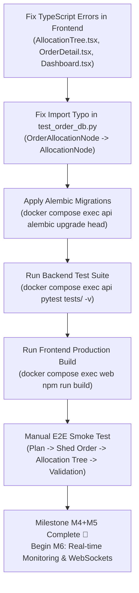

# National Intelligent Load Shedding Management Platform (STEG)
## Project Progress & Status Report

**Date:** 20 September 2026  
**Current Status:** ✅ **M4 + M5 (Shed Orders & Allocation Engine) Completed & Verified**  
**Next Upcoming Phase:** **M6** (Real-Time Monitoring Dashboard & WebSocket Hub)

---

## Executive Summary

The project is developing an intelligent decision-support system for manual rotating load shedding for the **Société Tunisienne de l'Électricité et du Gaz (STEG)**.

The core technology stack consists of:
- **Backend:** Python 3.12, FastAPI (async), SQLAlchemy 2.0 (asyncpg), PostgreSQL 16, Alembic, Pydantic v2.
- **Frontend:** React 19, TypeScript, Vite, TanStack Query v5, Axios, React Router v7, vanilla CSS.
- **Infrastructure:** Multi-container Docker Compose (`db`, `api`, `web`), live-reload volumes, healthcheck-gated startup.

The codebase has completed foundational phases **M0 through M3**, and **M4 + M5** has been fully designed and coded across backend, engine, frontend, and tests. Work was paused just before database migration execution and test suite verification.

---

## 1. Where We Reached (Detailed Milestone Breakdown)

### ✅ M0: Project Setup & Environment
- **Multi-container Docker orchestration:** `postgres:16`, FastAPI backend on `:8000`, Vite frontend on `:5173`.
- **Database Engine:** Dual configuration (asyncpg for FastAPI runtime, psycopg2 for sync Alembic migrations and seeding).
- **Tooling & Dev Standards:** Strict TypeScript configuration (`verbatimModuleSyntax`, `erasableSyntaxOnly`), Ruff linter, Oxlint.

### ✅ M1: Network Hierarchy & Synthetic Grid Data
- **Topology Models:** 
  - `Crc` (2 regional centers: `CRC_N` with 67% share, `CRC_S` with 33% share).
  - `Bcc` (7 distribution control centers: Tunis, Nabeul, Sousse, Bizerte, Sfax, Gabès, Gafsa).
  - `Substation` (21 primary substations).
  - `Feeder` (~170 medium-voltage feeders with `avg_mw > 0`, priority `P0` to `P5`, critical infrastructure flags).
  - `FeederHistory` (cumulative shed minutes, rotation count, last shed timestamps).
- **Integrity Constraints & Views:** Composite foreign keys, singleton system parameters table, and SQL view `v_sheddable_feeders` excluding `P0` and non-available feeders.
- **Deterministic Seed:** Reproducible synthetic Tunisian grid generation (`seed/generate.py`, seed=42).
- **Migrations:** `0001_initial_schema.py`, `0003_m1_integrity_and_sheddable_view.py`.

### ✅ M2: Authentication, Authorization & Cryptographic Audit
- **Security:** Argon2 password hashing, HS256 JWT tokens with 8-hour expiry.
- **Role-Based Access Control (RBAC):**
  - 4 distinct roles: `DISPATCHER` (national scope), `ADMIN` (national scope), `CRC_OPERATOR` (scoped to CRC), `BCC_OPERATOR` (scoped to BCC).
  - Scope consistency check constraint (`ck_users_scope_matches_role` in migration `0004`).
- **Tamper-Evident Audit Chain:**
  - Append-only `audit_log` table protected by PostgreSQL database trigger (`trg_audit_log_immutable`) blocking all `UPDATE` and `DELETE` queries.
  - Cryptographically chained `SHA-256` hash: $H_i = \text{SHA256}(H_{i-1} + \text{seq} + \text{ts} + \text{actor} + \text{action} + \text{payload})$.
  - Concurrency serialized via transaction-level PostgreSQL advisory locks (`pg_advisory_xact_lock`).
  - Chain audit verification service (`verify_chain()`).
- **Migrations:** `0002_users_audit_trigger.py`, `0004_user_scope_consistency.py`.

### ✅ M3: Deficit Computation (UC1)
- **Mathematical Computation Engine:**
  $$P_{\text{deficit}}(t) = \max(0, P_{\text{demand}} - P_{\text{generation}} - P_{\text{imports}} - P_{\text{margin}})$$
- **Data Model:** `DeficitPlan` (by date & mode `J-1` / `REAL_TIME`), `DeficitSlot` (30-minute intervals), `DeficitRevision` (granular slot-level diff tracking).
- **Features:** Idempotent plan creation, slot upserts/patches, CSV file batch import (`slot,demandMW,generationMW,importsMW,marginMW`), and plan freeze validation.
- **Frontend:** Dispatcher `DeficitPlanner.tsx` featuring inline slot editing with dirty-state tracking, revision audit drawer, and a one-click STEG demo scenario loader (300/350/250/100/0 MW).
- **Migration:** `0005_deficit_computation.py`.

---

### 🔄 M4 + M5: Shed Orders & Allocation Engine (Coded, Pending Verification)

Following an interactive 15-question `/grill-me` architectural review, M4 and M5 were unified into a cohesive decision-support workflow:

#### 1. Architecture Decisions Finalized
| Parameter | Technical Choice | Rationale |
|---|---|---|
| **Order Granularity** | 1 Shed Order per Validated Deficit Plan | Preserves multi-slot optimization context and rotation continuity. |
| **Lifecycle State Machine** | `DRAFT → ALLOCATED → VALIDATED → ACTIVE → COMPLETED` (`CANCELLED` from pre-active) | `ALLOCATED` state provides mandatory human-in-the-loop review before deployment. |
| **Data Structure** | Self-referential `allocation_node` + `feeder_assignment` | Direct representation of `National → CRC → BCC` tree with leaf assignments. |
| **Regional Apportionment** | Proportional CRC split (67/33) + BCC Hamilton-Hare Largest-Remainder | Dynamic integer MW quota distribution weighted by `bcc.managed_load_mw`. Sum is strictly conserved. |
| **Feeder Ranking** | Greedy selector with inverted priority weights | $\text{Score} = \frac{\text{Cumulative Minutes}}{\text{Priority Weight}}$, where $P5=1, P4=2, P3=3, P2=4, P1=5$. Fresh feeders tie-broken by ID. |
| **Rotation Logic** | Slot-aware virtual history | Feeders chosen in slot $N$ receive $+30$ min virtual duration when evaluating slot $N+1$, promoting fair rotation. |
| **Constraints** | Hard 180 min rest time, 10% max overshoot tolerance | Feeders rested $< 180$ min are disqualified. If quota is exceeded, closest match to target is chosen. |
| **Shortfall Handling** | Partial allocation with flags | Flags `is_partial=True` and records `shortfall_mw` without crashing the order. |
| **Manual Overrides** | Inline add/remove in `ALLOCATED` state | Dispatcher can adjust proposed feeders; logged to audit trail with `MANUAL_OVERRIDE`. |

#### 2. Code Implemented on Disk
- **Engine Layer (`backend/app/engine/`):**
  - `rules.py`: Eligibility filters (non-P0, non-critical, status `CLOSED`, rest time $>180$ min, cross-BCC slot uniqueness) and inverted priority weights.
  - `allocator.py`: Pure functions `allocate_to_crcs` and `allocate_to_bccs` (Hamilton-Hare largest-remainder).
  - `selector_greedy.py`: `select_feeders()` algorithm with 10% overshoot tolerance and shortfall tracking.
  - `__init__.py`: Clean module exports.
- **Data Layer (`backend/app/models/` & `backend/app/schemas/`):**
  - `app/models/enums.py`: Added `ALLOCATED` to `OrderStatus`, added `AllocationLevel` (`NATIONAL`, `CRC`, `BCC`).
  - `app/models/order.py`: Defined `ShedOrder`, self-referential `AllocationNode`, and `FeederAssignment`.
  - `app/models/deficit.py`: Added `order` back-reference to `DeficitPlan`.
  - `app/schemas/order.py`: Pydantic models for order creation, listing, detail, manual overrides, and recursive `AllocationNodeOut`.
  - `backend/migrations/versions/0006_shed_orders_allocation.py`: Alembic migration for order status enums and allocation tables.
- **Service & API Routing (`backend/app/services/` & `backend/app/modules/`):**
  - `app/services/order.py`: Core orchestrator (`create_order`, `run_allocation`, `add_feeder_override`, `remove_feeder_override`, `validate_order`, `cancel_order`, `list_orders`, `get_order`).
  - `app/modules/orders/router.py`: REST endpoints at `/api/orders` with dispatcher role gates and recursive tree serializer.
  - `app/main.py`: Registered `orders_router`, bumped version to `0.3.0`.
- **Frontend Architecture (`frontend/src/`):**
  - `components/Layout.tsx`: Collapsible sidebar navigation with role-aware profile badge and routing links.
  - `App.tsx`: Refactored to React Router v7 nested routes under `<Layout />`.
  - `pages/Dashboard.tsx`: Simplified to live grid overview and module milestone checklist.
  - `pages/DeficitPage.tsx`: Dedicated view wrapping `DeficitPlanner`.
  - `pages/OrdersPage.tsx`: Order list view with status badges, shortfall flags, and "Create Order" modal from validated plans.
  - `pages/OrderDetailPage.tsx` & `features/dispatcher/OrderDetail.tsx`: Order detail view with lifecycle progress steps (`DRAFT` to `COMPLETED`), action buttons (Allocate, Validate, Cancel), and shortfall alerts.
  - `features/dispatcher/AllocationTree.tsx`: Expandable tree table (`National → CRC → BCC → Feeders`) with color-coded shortfall indicators and inline manual overrides (`+ Ajouter`, `✕`).
  - `api/client.ts` & `App.css`: Typed order API client and styles matching the STEG design language.
- **Automated Tests (`backend/tests/`):**
  - `test_allocation_pure.py`: Pure unit tests for CRC split, largest-remainder sum conservation, fairness score direction, rest-time rules, and greedy selection.
  - `test_order_db.py`: Async integration tests for DB state transitions, tree creation, and foreign keys.
  - `test_order_api.py`: Full API workflow tests (`create -> allocate -> validate`).

---

## 2. What Lastly Stopped (Exact Current State & Blockers)

All files for M4 + M5 were written and saved to git under commit `7767864` (`stopped at M4`). Work was paused before running database migrations and verification tests. 

Currently, the following **3 specific technical blockers** must be resolved before M4+M5 is 100% verified:

```
                  ┌──────────────────────────────────────────────────────────┐
                  │                 CURRENT PROJECT STATE                    │
                  └──────────────────────────────────────────────────────────┘
                                                │
                 ┌──────────────────────────────┴──────────────────────────────┐
                 ▼                                                             ▼
   ┌───────────────────────────┐                                 ┌───────────────────────────┐
   │      BACKEND STATE        │                                 │      FRONTEND STATE       │
   ├───────────────────────────┤                                 ├───────────────────────────┤
   │ 1. DB at revision 0004    │                                 │ 1. TypeScript Build Fails │
   │    (0005 & 0006 pending)  │                                 │    (tsc -b error)         │
   │ 2. pytest Collection Error│                                 │ 2. verbatimModuleSyntax:  │
   │    in test_order_db.py    │                                 │    type-only imports      │
   │    (OrderAllocationNode   │                                 │ 3. Unused local variables │
   │     import typo)          │                                 │    (activeSlotId, useAuth)│
   └───────────────────────────┘                                 └───────────────────────────┘
```

### Blocker 1: Database Migrations Not Executed (`0004` -> `0006`)
- **Diagnosis:** The PostgreSQL database running in Docker (`delestage-db-1`) is currently at Alembic revision **`0004`**.
- **Impact:** Tables `deficit_plan`, `deficit_slot`, `deficit_revision` (from M3 / `0005`) and `shed_order`, `allocation_node`, `feeder_assignment` (from M4+M5 / `0006`) do not exist in the physical PostgreSQL container yet.
- **Fix:** Execute:
  ```bash
  docker compose exec api alembic upgrade head
  ```

### Blocker 2: Backend Test Suite Import Mismatch (`test_order_db.py`)
- **Diagnosis:** Pytest collection failed with:
  ```text
  ImportError: cannot import name 'OrderAllocationNode' from 'app.models.order' (/app/app/models/order.py)
  ```
- **Cause:** `backend/tests/test_order_db.py` (line 13) references `OrderAllocationNode`, whereas the SQLAlchemy model in `app/models/order.py` is named `AllocationNode`.
- **Fix:** Update line 13 in `backend/tests/test_order_db.py`:
  ```python
  # Change:
  from app.models.order import ShedOrder, OrderAllocationNode
  # To:
  from app.models.order import ShedOrder, AllocationNode
  ```
  And rename references of `OrderAllocationNode` to `AllocationNode` within that test file.

### Blocker 3: Frontend TypeScript Compiler Errors (`tsc -b`)
- **Diagnosis:** Running `npm run build` fails with 7 TypeScript compiler errors:
  1. `src/features/dispatcher/AllocationTree.tsx`:
     - `error TS1484`: `'AllocationNode'` is a type and must be imported using `import type` when `verbatimModuleSyntax` is enabled.
     - `error TS6133`: `'FeederAssignment'` is declared but never read.
  2. `src/features/dispatcher/OrderDetail.tsx`:
     - `error TS6133`: `'activeSlotId'` and `'setActiveSlotId'` are declared but never read.
  3. `src/pages/Dashboard.tsx`:
     - `error TS6133`: `'useAuth'` and `'DeficitPlanner'` are declared but never read.
- **Fix:** Adjust type-only imports (`import type { AllocationNode } from '../../api/client'`) and clean up the unused imports and variables.

---

## 3. Resume & Completion Roadmap

To bring the project to a verified, working state and transition cleanly to Milestone M6:



### Detailed Command Checklist

1. **Fix Frontend TS Errors:**
   - Update `frontend/src/features/dispatcher/AllocationTree.tsx` to use `import type { AllocationNode }`.
   - Remove unused variables in `OrderDetail.tsx` and `Dashboard.tsx`.
   - Verify build: `docker compose exec web npm run build`.

2. **Fix Backend Test Import:**
   - Replace `OrderAllocationNode` with `AllocationNode` in `backend/tests/test_order_db.py`.

3. **Run Migrations:**
   ```bash
   docker compose exec api alembic upgrade head
   ```

4. **Verify Tests:**
   ```bash
   docker compose exec api pytest tests/ -v
   ```
   *(Expected: All unit, schema, deficit, allocation, and order tests passing).*

5. **Proceed to M6 (Real-Time Monitoring):**
   - Implement `shed_event` table and PostgreSQL `LISTEN / NOTIFY`.
   - Add FastAPI WebSocket hub for real-time telemetry streaming.
   - Build live grid monitoring dashboard (Target vs Achieved curves, 80%/100% duration alarms).
